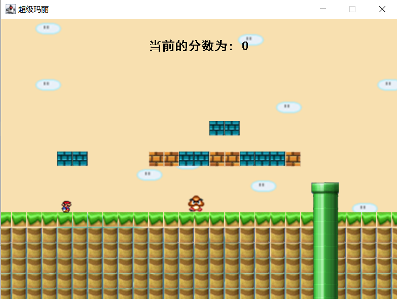

# SuperMario
基于Java开发的超级马里奥游戏

### 技术栈

编程语言: Java
图形界面: Java Swing
音频播放: JLayer库 (用于播放音乐)
图像处理: Java AWT 和 BufferedImage

### 项目结构

**MyFrame**: 游戏主窗口，继承自JFrame，负责游戏的显示和输入处理
**Mario**: 马里奥角色类，控制玩家角色的行为和状态
**BackGround**: 背景场景类，管理每个关卡的布局和元素
**Obstacle**: 障碍物类，包括地面、砖块、管道等游戏元素
**Enemy**: 敌人类，包括蘑菇怪和食人花两种敌人
**StaticValue**: 静态资源管理类，负责加载和存储游戏图像资源

### 快速启动

**Setp1**：在lib目录下找到`jl-1.0.1.jar`，右键选择`Add as Library`（也可直接用Maven添加依赖）

**step2**：找到`src/com/sx/MyFrame.java`，右键运行 	